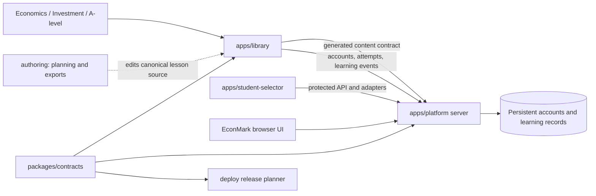

# Architecture and ownership

The platform is a modular monorepo with one HTTP service, one origin, one account
system and one persistent database. npm workspaces organize code ownership; they
are not separate deployments. There is no source synchronization with the former
standalone projects.

## Ownership and sharing

| Owner | Owns | How other parts use it |
|---|---|---|
| `apps/platform` | HTTP composition, accounts, sessions, roles, API, SQLite, uploads, grading and EconMark UI | Same-origin `/api/`, `/platform/account-shell.js`, `/econmark/` |
| `apps/library` | Public courses, lesson data, definitions, course renderers, catalogue generation | Public routes and the generated content contract |
| `apps/student-selector` | Selector UI, feedback text and selection interactions | `StudentSelector.mount/open`, with injected roster/session adapters |
| `packages/contracts` | Content filenames, schema versions, producer/consumer validation and public-file rules | Declared npm dependency using explicit exports |
| `authoring` | Planning, preferences, export tools and retained editable references | Reads canonical public lesson files; produces ignored classroom exports |
| `deploy` | File selection, release installation, proxy configuration and rollback | Builds a release from explicitly selected inputs |

Applications do not import another application's implementation. Shared packages
must not import applications. Tests and authoring checks may inspect another
owner's files, but runtime integration uses the interfaces above. The root
`check:architecture` command enforces workspace privacy, a single lockfile,
declared shared dependencies and literal module-import boundaries.

The server deliberately knows where the Library and Selector are mounted. This
composition belongs in `app-config.mjs` and `app-server.mjs`. The Library owns its
catalogue builder; the server reads its output without importing the builder.
It validates schema versions, matching build hashes, IDs, quiz references and
answers before opening the stores. Grading history is stored in the database;
regenerating the catalogue does not delete previous attempts or learning records.

The shared account shell remains owned by Platform because it implements that
API's account lifecycle. Library's `platform-auth.js` and `platform-shell.js` are
adapters for Library pages, quiz submission and learning events. They do not own
another account implementation. Selector receives protected data through adapters;
its explicitly supported public classroom mode remains a separate browser session.

Share behavior at its narrowest useful scope. Economics uses `assets/` for its
renderer, Investment uses `investment-analysis/course-assets/`, and A-level uses
`a-level/shared-html/`. Their design, slide schemas and teaching interactions are
intentionally separate. Common deck navigation and the selector panel can remain
Library-owned shared assets. Extract a package when multiple *applications* need
the same implementation or contract; do not create a universal lesson renderer.

## Active content, legacy and working files

| State | Rule | Runtime and release treatment |
|---|---|---|
| Active lesson | Linked from its course landing page | Included in the catalogue and current checks |
| Draft | New work not yet linked; label it as a draft | Not registered as active; a public HTML file may still have a direct URL |
| Compatibility content | Old lessons, old course maps, historical Business pages and archive-named lesson folders | Existing eligible public URLs remain available, but are not automatically catalogued |
| Private reference/archive | `authoring/`, exact `archive/` directories, textbooks, old deployment sources and research references | Retained locally; excluded from HTTP and release inputs |
| Generated runtime data | `apps/library/generated/` manifest and quiz bank | Versioned outputs, rebuilt from active sources; quiz bank is server-only |
| Working output | `tmp/`, `.codex-tmp*/`, reports, caches, classroom exports | Ignored by Git and excluded from releases |
| Persistent data | Accounts, rosters, images, attempts and other records | Outside releases; never treated as disposable build output |

`apps/library/scripts/content-sources.js` resolves links on the Economics,
Investment and A-level landing pages. It deduplicates handout/quiz views and ignores
commented links. Dropping an old or experimental HTML file into a directory cannot
register it in the catalogue. Linking a completed lesson and rebuilding publishes
its catalogue entry. Catalogue removal does not remove the HTML URL or erase data.

Legacy sources are preserved rather than repeatedly copied into new active trees.
Consult `authoring/README.md` for the external recovery archive. Do not delete old
lesson directories merely because their names look obsolete: they may preserve
historical links. Before relocating a compatibility file, inspect incoming links,
retain the needed URL/redirect, and verify the affected pages. No archive expiry or
automatic deletion policy is implied by this architecture.

Existing loose PowerPoint exports in the repository root are pre-consolidation
working material. New source decks belong under the relevant `authoring/` course;
reproducible exports belong in its ignored `outputs/`. Root files are not release
inputs unless explicitly named by the release planner.

## Public and release boundaries

`packages/contracts/public-files.cjs` is the shared public-file policy. Both Node
and `deploy/release-files.mjs` use it. Public source notes remain accessible where
linked by courses. Nested scratch directories, research references, test harnesses,
server code, prompts, config, roster CSVs and quiz answer banks are not public.
The proxy passes application requests to Node, so a filesystem shortcut cannot
bypass this policy. Existing URLs and cache headers remain owned by the server.

A release includes eligible public assets, the platform server and operational
scripts, grading schemas/prompts, the content builder and its inputs, generated
catalogues, shared contracts and deployment scripts. It excludes authoring,
private archives, app-local deployment history, tests and local output. File
selection rejects symbolic links rather than following them outside the source
tree. Preview the selection with `npm run release:plan`; use
`node deploy/release-files.mjs --output <file>` for the exact tar input list.

The publisher rebuilds content, checks and tests locally, and stops on any failed
native command before upload. Content generation replaces files atomically so an
overlay release cannot rewrite a prior release through an inherited hard link.
Changing source or release policy locally does not deploy it or change DNS.

## Validation

- `npm run check:architecture`: ownership and module boundaries.
- `npm run test:architecture`: contract, publication and release boundary tests.
- `npm run check`: architecture, Platform required files and active content.
- `npm test`: architecture, Platform behavior, active content and Selector.
- `npm run test:legacy`: preserved old Investment generators and syllabus contracts.
- `npm run test:legacy:browser --workspace=@oehler-huang/library`: old Investment
  design expectations tagged `@legacy`; Platform HTTP tests verify historical URLs.
- `npm run test:full`: current checks, legacy checks and the full Library browser suite.

Legacy checks remain available explicitly; they do not set requirements for new
lessons. The retained browser suite currently contains stale expectations for the
old course-map trade timing and legacy handout structure; these are not assertions
about the current Investment course. Follow root `AGENTS.md` for narrower classroom content edits and browser
checks. A change to this shared architecture requires `npm test`; a catalogue
builder change also requires rebuilding the generated files and Library smoke
checks. No new bundler, UI framework or independently deployed service is needed.
